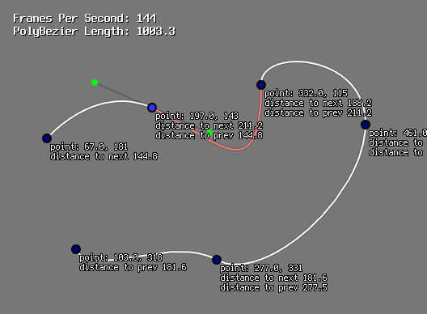

# Pen
A composite cubic bézier curve editor

## Features
- GLFW3 + OpenGL 2.0 Backend
- SDL2 Backend
- Event queue
- Bitmap font renderer
- Zooming and panning
- Distance calculation: 
- Interpolation: allowing for accurate curve subdivision

## Usage
- Click to set points on the canvas
- Click and drag the handles to modify the curve's shape
- Right click on a point to delete it

## Building the project
```bash
$ git clone --recurse-submodules https://github.com/jcklmbrt/pen.git
$ mkdir pen/build
$ cd pen/build
```
To select the SDL2 backend use
```bash
$ cmake -G Ninja -DUSE_SDL2=ON .. 
```
To select the GLFW3 backend use
```bash
$ cmake -G Ninja -DUSE_GLFW=ON ..
```
Then, to build the executable
```bash
$ ninja
```